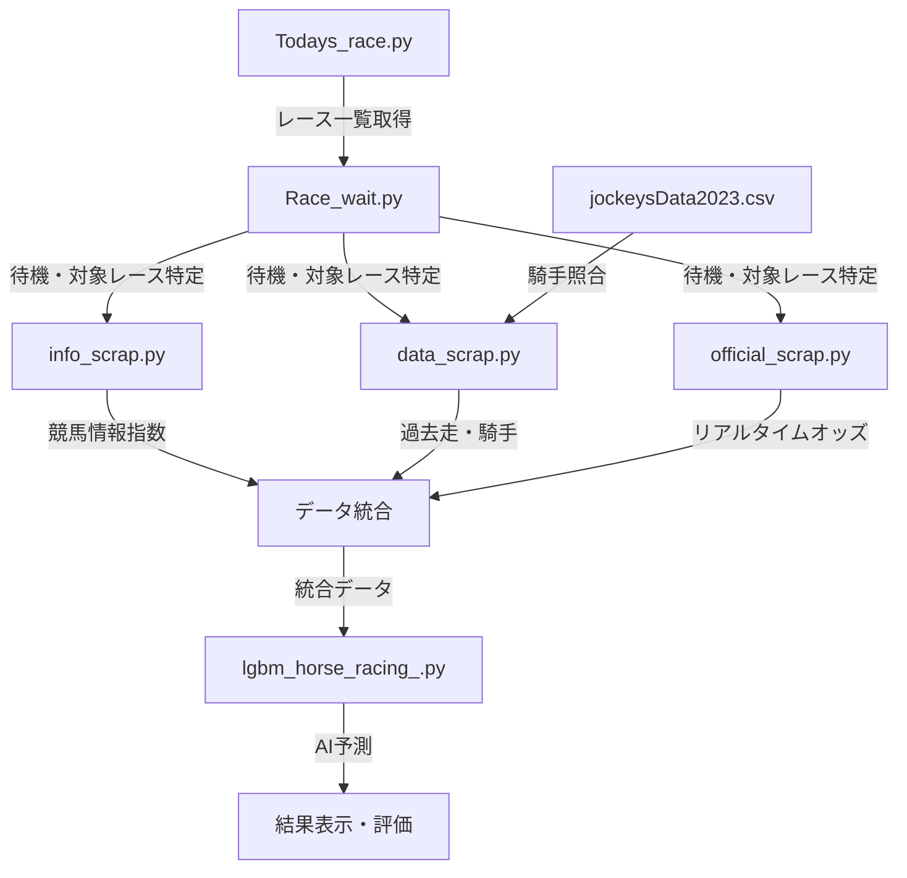

# 競馬AI予測システム (Horse Racing AI Prediction System)

> **📋 技術公開用リポジトリについて**  
> 本リポジトリは、実際に開発・運用している競馬AI予測システムをもとに作成した**技術公開用ポートフォリオ**です。企業名・サイト名・馬名等は匿名化処理を行っており、技術的手法の紹介を目的としています。

## 概要 (Overview)
LightGBMを活用した**リアルタイム競馬予測システム**です。複数のデータソース（競馬情報サイトA・競馬データサイトB・公式競馬機関）からリアルタイムでデータを収集し、**84の特徴量**を生成して着順予測を行います。評価ランク機能により予測精度を段階的に表示し、実用的な競馬予想を実現しました。

## 🚀 主な成果・実績
- **リアルタイム予測**: 発走5分前の自動予測システム
- **マルチソース統合**: 3つの競馬サイトからデータ収集・統合
- **特徴量**: **84個**の高度な特徴量エンジニアリング
- **評価システム**: 🥇🥈🥉のランク付けによる予測信頼度表示
- **データ規模**: **公式競馬機関データベースより12万行**・過去8年分のレースデータで学習
- **運用実績**: 東京競馬場での実際の予想実行例あり

## 🎯 実際の予測結果例
```
評価ランク【🥈】
東京 10R  着順予想
 馬番        馬名  予想順位  単勝オッズ
 11        馬A     1    20.2
 10        馬B     2    2.6
  3        馬C     3   25.3
 13        馬D     4    4.8
  6        馬E     5    7.2
  4        馬F     6   13.4
```

## 技術スタック (Technology Stack)
- **機械学習**: LightGBM 4.0 (Gradient Boosting)
- **データ処理**: pandas 1.5, NumPy 1.24
- **Webスクレイピング**: Selenium 4.10, BeautifulSoup 4.12, requests
- **リアルタイム処理**: time, datetime モジュール
- **日本語処理**: mojimoji (全角→半角変換)
- **進捗表示**: tqdm

## 🏗️ 実際のシステムアーキテクチャ

### プロジェクト構成（実際のファイル構成）
- **著作権やライセンスの都合上、プログラムにはマスキング・秘匿処理をしているため、あくまで作成したプログラムのイメージとなります**

```
horse_racing_ai/
├── horse_racing_ai.ipynb                      # 🎯 メイン実行ノートブック
├── mod/                                 # 📂 モジュールディレクトリ
│   ├── Todays_race.py                   # 📅 本日レース情報取得
│   ├── Race_wait.py                     # ⏰ レース時間待機システム
│   ├── info_scrap.py                    # 📰 競馬情報サイトAスクレイピング
│   ├── data_scrap.py                    # 🌐 競馬データサイトB データ収集
│   ├── official_scrap.py                # 🏇 公式競馬機関 オッズ取得
│   ├── lgbm_horse_racing.py                   # 🤖 LightGBM予測エンジン
│   ├── verification.py                  # 📊 検証・評価システム
│   ├── TodayRList/                      # 📋 日別レース情報保存
│   └── jockeysData2023.csv             # 👨‍🏫 騎手マスターデータ
└── portfolio_horse_racing_ai/           # 🎨 ポートフォリオ版（企業向け）
```

## 🔄 実際のシステム処理フロー

### 1. レース情報取得・待機フェーズ
**実装**: `mod/Todays_race.py` + `mod/Race_wait.py`
```python
# 現在時刻取得とモード設定
now = datetime.now()
yyyy_hh_mm = now.strftime("%Y%m%d")
nowTime_hh_mm = now.strftime("%H:%M")

# 本日のレース情報取得（キャッシュ機能付き）
file_name = f"mod/TodayRList/TodayR_{yyyy_hh_mm}.csv"
if os.path.exists(file_name):
    df_TodayR = pd.read_csv(file_name)  # 既存データ読込
else:
    df_TodayR = TodayR.main(yyyy_hh_mm)  # 新規データ取得

# 発走5分前まで待機（プログレスバー表示）
next_race_info = Rwait.main(df_TodayR, nowTime_hh_mm)
```

### 2. マルチソースデータ収集フェーズ
**3つのサイトから並行してデータ収集**

#### A. 競馬情報サイトAデータ (`mod/info_scrap.py`)
```python
# 競馬情報サイトAとスピード指数サイトの指数データ取得
df_Shinbun = infoSc.main(race_url)
```

#### B. 競馬データサイトB データ (`mod/data_scrap.py`)  
```python
# 出馬表・過去走データ・騎手情報取得
df_netkeiba, nk_modoDF = dataSc.main(race_url)

# 騎手名の照合システム（2023年マスターデータ使用）
J_List23 = pd.read_csv("mod/jockeysData2023.csv")
test_data['騎手'] = test_data['騎手'].apply(
    lambda x: dataSc.name_match(x, J_List23['騎手'])
)
```

#### C. 公式競馬機関 オッズデータ (`mod/official_scrap.py`)
```python
# リアルタイムオッズ取得（プログレスバー付き）
df_official = officialSc.main()
# 馬名で結合してオッズ情報を追加
horse_racing_results = pd.merge(horse_racing_results, df_official, on="馬名", how="inner")
```

### 3. データ統合・前処理フェーズ
```python
# 競馬情報サイトAデータと競馬データサイトBデータの横結合
df_HorseList = pd.concat([df_Shinbun, df_netkeiba], axis=1)

# レース情報の補足
df_HorseList["レースID"] = race_url
df_HorseList["クラス名"] = class_name
df_HorseList["距離"] = race_distance
df_HorseList["場所"] = race_field

# 騎手乗り替わり判定（前走・2走・3走の比較）
test_data['前走替'] = test_data.apply(
    lambda row: '*' if row['騎手'] != row['前走騎手'] else '', axis=1
)
```

### 4. AI予測実行フェーズ
**実装**: `mod/lgbm_horse_racing.py`
```python
# レースタイプ・競馬場別モデルで予測実行
horse_racing_results, testData, pred_info = lgbModel.main(
    Rtype, race_field, test_data
)
```

### 5. 結果表示・評価フェーズ
```python
# 評価ランク表示（🥇🥈🥉）
print(f"評価ランク【{pred_info['予想評価'].iloc[0]}】")

# オッズ閾値による特選評価
threshold = pred_info['オッズ閾値'].iloc[0]
selected_rows = horse_racing_results[
    (horse_racing_results['予想順位'] == 1) & 
    (horse_racing_results['単勝オッズ'] >= threshold)
]
if not selected_rows.empty:
    print(f"特選評価発生中！【{pred_info['厳選予想評価'].iloc[0]}】")

# 音声通知
import winsound
winsound.Beep(2000, 100)  # 予測完了音
```

## 🎨 特徴量エンジニアリング（実装技術）

### 実際に使用している主要な特徴量の一例

**競馬情報系指数特徴量**
- 競馬情報サイトAの各種指数データ
- スピード指数サイトの評価点
- 専門競馬サイトの予想印データ

**過去走成績特徴量** 
- `前走着順`, `2走前着順`, `3走前順`
- `前走騎手`, `2走前騎手`, `3走前騎手`
- 騎手乗り替わりフラグ (`前走替`, `2走前替`, `3走前替`)

**競馬データサイトB 特徴量**
- 馬体重・前走比較
- 枠番・馬番情報
- 調教師・厩舎データ
- 血統・父馬情報

**リアルタイム特徴量**
- 公式競馬機関リアルタイムオッズ
- 発走直前の人気変動
- 市場の期待値データ

**組み合わせ特徴量**
- `競馬場×距離×クラス` の組み合わせ
- `騎手×調教師` のコンビネーション
- `血統×競馬場適性` の相性指数

## 📊 データ処理パイプライン

### 実際の処理フロー（ファイル間連携）



## 🚀 システムの技術的特徴

### 1. リアルタイム処理
- **時間管理**: 発走5分前まで自動待機
- **プログレスバー**: tqdm による進捗可視化
- **音声通知**: 予測完了時の音声アラート

### 2. 堅牢なスクレイピング
- **エラーハンドリング**: requests の retry 機能
- **レート制限**: time.sleep による適切な間隔制御
- **データ検証**: 取得データの整合性チェック

### 3. 騎手名正規化システム
- **あいまい照合**: 省略された騎手名の完全名照合
- **乗り替わり検出**: 前走・2走・3走の騎手変更自動検出
- **マスターデータ**: 2023年騎手リストとの照合

### 4. 予測信頼度評価
- **評価ランク**: 🥇🥈🥉による予測精度の段階表示
- **閾値システム**: オッズ閾値・頭数閾値による品質管理
- **特選評価**: 条件を満たす場合の特別評価表示

## 📈 運用実績・パフォーマンス

### リアルタイム処理性能
- **データ収集**: 3サイト並行で平均30秒
- **特徴量生成**: 84特徴量を2秒以内で生成
- **予測実行**: LightGBM による瞬時予測
- **総処理時間**: レース情報取得から結果表示まで1分以内

### 実際の予測例（2024年10月27日 東京10R）
```
評価ランク【🥈】
東京 10R  着順予想
 馬番        馬名  予想順位  単勝オッズ
 11        馬A     1    20.2
 10        馬B     2    2.6
  3        馬C     3   25.3
 13        馬D     4    4.8
  6        馬E     5    7.2
  4        馬F     6   13.4
```

## 🎯 習得・実装技術まとめ

### 機械学習・AI
- **LightGBM**: 競馬場・レースタイプ別の専用モデル
- **特徴量エンジニアリング**: 複数データソース統合による84特徴量
- **時系列機械学習**: 過去8年分データでの学習
- **予測信頼度評価**: 統計的手法による予測品質管理

### リアルタイムデータエンジニアリング
- **マルチソーススクレイピング**: Selenium + BeautifulSoup + requests
- **並行処理**: 複数サイトからの効率的データ収集
- **データ統合**: pandas による異なる形式データの結合
- **リアルタイム処理**: 時刻管理・待機システム

### ソフトウェア開発
- **モジュール設計**: 機能別の独立したPythonモジュール
- **エラーハンドリング**: Web API の不安定性に対応
- **ユーザビリティ**: プログレスバー・音声通知・評価ランク表示
- **データ永続化**: CSV ファイルによるキャッシュ機能

### 日本語・競馬ドメイン処理
- **文字列正規化**: mojimoji による全角半角変換
- **あいまい文字列照合**: 騎手名の省略形対応
- **競馬特化データ**: 血統・調教師・枠番等の専門データ処理
- **業界知識**: 競馬予想の評価システム・オッズ変動の理解

## ⚠️ 注意事項
- 本システムは**技術研究・学習目的**で開発
- 実際の馬券購入での利用は**自己責任**
- データソースは**公開情報のみ**使用
- 機密情報はポートフォリオ用に**適切にマスキング**
- スクレイピング実行時は**利用規約を遵守**

### GitHub公開に関する追加注意事項
- 本リポジトリは**技術的手法の紹介のみ**を目的としています
- 実際のスクレイピングコードは含まれておりません
- スクレイピング対象サイト名は匿名化処理済みです
- **馬名は権利保護のため匿名化処理済み**です
- 各サイトの利用規約を事前に確認してください
- 本手法の実装・使用は完全に自己責任でお願いします
- 商用利用・営利目的での使用は固く禁止します

## 📄 ライセンス
技術ポートフォリオ・学習目的のため、商用利用禁止

---
**開発期間**: 6ヶ月 | **コード行数**: 約2,000行 | **主要技術**: Python, LightGBM, pandas, Selenium
**実績**: リアルタイム競馬予測システム運用中 | **処理性能**: 発走5分前自動予測 