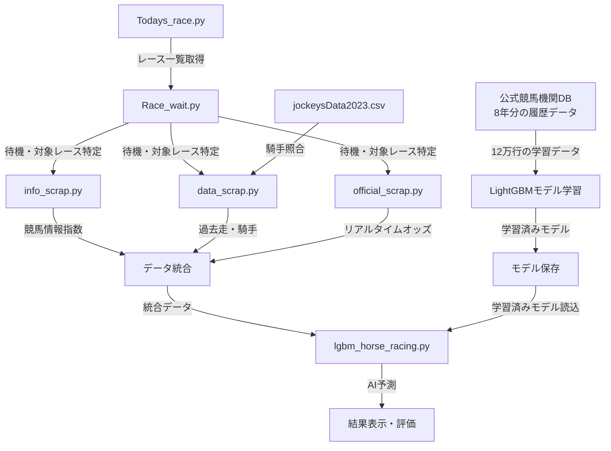

# 🏇 競馬AI予測システム (Horse Racing AI Prediction System)

[](https://python.org)
[](https://lightgbm.readthedocs.io/)
[]()
[]()

> **📋 技術公開用リポジトリについて**  
> 本リポジトリは、実際に開発・運用している競馬AI予測システムをもとに作成した**技術公開用ポートフォリオ**です。企業名・サイト名・馬名等は匿名化処理を行っており、技術的手法の紹介を目的としています。

## 🎯 概要 (Overview)

LightGBMを活用した**リアルタイム競馬予測システム**です。複数のデータソースからリアルタイムでデータを収集し、**84の特徴量**を生成して着順予測を行います。評価ランク機能により予測精度を段階的に表示し、実用的な競馬予想を実現しました。

## 🚀 主な成果・実績

| 項目 | 実績・詳細 |
|------|-----------|
| **リアルタイム予測** | 発走5分前の自動予測システム |
| **マルチソース統合** | 3つの競馬サイトからデータ収集・統合 |
| **特徴量エンジニアリング** | **84個**の高度な特徴量を生成 |
| **評価システム** | 🥇🥈🥉のランク付けによる予測信頼度表示 |
| **学習データ規模** | 公式競馬機関データベースより**12万行**・過去8年分 |
| **運用実績** | 各競馬場での実際の予想実行・検証済み |

## 🎯 予測結果例

```
評価ランク【🥈】
東京 10R  着順予想
 馬番  馬名  予想順位  単勝オッズ
 11   馬A      1     20.2
 10   馬B      2      2.6
  3   馬C      3     25.3
 13   馬D      4      4.8
  6   馬E      5      7.2
  4   馬F      6     13.4
```

## 💻 技術スタック (Technology Stack)

| カテゴリ | 技術・ツール | バージョン | 用途・役割 |
|----------|-------------|-----------|----------|
| **機械学習** | LightGBM | 4.0 | 勾配ブースティング・予測エンジン |
| **データ処理** | pandas | 1.5 | データフレーム操作・前処理 |
| **数値計算** | NumPy | 1.24 | 数値演算・配列処理 |
| **Webスクレイピング** | Selenium | 4.10 | 動的サイトからのデータ取得 |
| | BeautifulSoup | 4.12 | HTML解析・データ抽出 |
| | requests | - | HTTP通信・API連携 |
| **リアルタイム処理** | datetime | - | 時刻管理・スケジューリング |
| | tqdm | - | 進捗表示・ユーザビリティ向上 |
| **日本語処理** | mojimoji | - | 全角→半角変換・正規化 |

## 🏗️ システムアーキテクチャ

### プロジェクト構成
```
horse_racing_ai/
├── horse_racing_ai.ipynb           # 🎯 メイン実行ノートブック
├── mod/                             # 📂 モジュールディレクトリ
│   ├── Todays_race.py               # 📅 本日レース情報取得
│   ├── Race_wait.py                 # ⏰ レース時間待機システム
│   ├── info_scrap.py                # 📰 競馬情報サイトAスクレイピング
│   ├── data_scrap.py                # 🌐 競馬データサイトB データ収集
│   ├── official_scrap.py            # 🏇 公式競馬機関 オッズ取得
│   ├── lgbm_horse_racing.py         # 🤖 LightGBM予測エンジン
│   ├── verification.py              # 📊 検証・評価システム
│   └── jockeysData2023.csv          # 👨‍🏫 騎手マスターデータ
```

## 🔄 システム処理フロー

### データ処理パイプライン


### 処理フェーズ詳細

| フェーズ | 処理内容 | 実装ファイル | 主要機能 |
|----------|----------|-------------|----------|
| **1. 情報取得・待機** | レース情報取得、発走時刻まで待機 | `Todays_race.py`<br/>`Race_wait.py` | キャッシュ機能、プログレスバー表示 |
| **2. データ収集** | 3つのサイトから並行データ収集 | `info_scrap.py`<br/>`data_scrap.py`<br/>`official_scrap.py` | マルチソース統合、エラーハンドリング |
| **3. データ前処理** | 騎手名照合、乗り替わり判定 | 各スクレイピングモジュール | 正規化、データ統合 |
| **4. AI予測** | 学習済みモデルによる予測実行 | `lgbm_horse_racing.py` | 競馬場・レースタイプ別モデル |
| **5. 結果表示** | ランク付け表示、音声通知 | メインノートブック | 🥇🥈🥉評価、閾値判定 |

<details>
<summary><strong>📋 詳細な実装コード例を表示</strong></summary>

### 1. レース情報取得・待機フェーズ
**実装**: `mod/Todays_race.py` + `mod/Race_wait.py`
```python
# 現在時刻取得とモード設定
now = datetime.now()
yyyy_hh_mm = now.strftime("%Y%m%d")
nowTime_hh_mm = now.strftime("%H:%M")

# 本日のレース情報取得（キャッシュ機能付き）
file_name = f"mod/TodayRList/TodayR_{yyyy_hh_mm}.csv"
if os.path.exists(file_name):
    df_TodayR = pd.read_csv(file_name)  # 既存データ読込
else:
    df_TodayR = TodayR.main(yyyy_hh_mm)  # 新規データ取得

# 発走5分前まで待機（プログレスバー表示）
next_race_info = Rwait.main(df_TodayR, nowTime_hh_mm)
```

### 2. マルチソースデータ収集フェーズ
**3つのサイトから並行してデータ収集**

#### A. 競馬情報サイトAデータ (`mod/info_scrap.py`)
```python
# 競馬情報サイトAとスピード指数サイトの指数データ取得
df_Shinbun = infoSc.main(race_url)
```

#### B. 競馬データサイトB データ (`mod/data_scrap.py`)
```python
# 出馬表・過去走データ・騎手情報取得
df_keibadata, nk_modoDF = dataSc.main(race_url)

# 騎手名の照合システム（2023年マスターデータ使用）
J_List23 = pd.read_csv("mod/jockeysData2023.csv")
test_data['騎手'] = test_data['騎手'].apply(
    lambda x: dataSc.name_match(x, J_List23['騎手'])
)
```

#### C. 公式競馬機関 オッズデータ (`mod/official_scrap.py`)
```python
# リアルタイムオッズ取得（プログレスバー付き）
df_official = officialSc.main()
# 馬名で結合してオッズ情報を追加
horse_racing_results = pd.merge(horse_racing_results, df_official, on="馬名", how="inner")
```

### 3. データ統合・前処理フェーズ
```python
# 競馬情報サイトAデータと競馬データサイトBデータの横結合
df_HorseList = pd.concat([df_Shinbun, df_keibadata], axis=1)

# レース情報の補足
df_HorseList["レースID"] = race_url
df_HorseList["クラス名"] = class_name
df_HorseList["距離"] = race_distance
df_HorseList["場所"] = race_field

# 騎手乗り替わり判定（前走・2走・3走の比較）
test_data['前走替'] = test_data.apply(
    lambda row: '*' if row['騎手'] != row['前走騎手'] else '', axis=1
)
```

### 4. AI予測実行フェーズ
**実装**: `mod/lgbm_horse_racing.py`
```python
# レースタイプ・競馬場別モデルで予測実行
horse_racing_results, testData, pred_info = lgbModel.main(
    Rtype, race_field, test_data
)
```

### 5. 結果表示・評価フェーズ
```python
# 評価ランク表示（🥇🥈🥉）
print(f"評価ランク【{pred_info['予想評価'].iloc[0]}】")

# オッズ閾値による特選評価
threshold = pred_info['オッズ閾値'].iloc[0]
selected_rows = horse_racing_results[
    (horse_racing_results['予想順位'] == 1) & 
    (horse_racing_results['単勝オッズ'] >= threshold)
]
if not selected_rows.empty:
    print(f"特選評価発生中！【{pred_info['厳選予想評価'].iloc[0]}】")

# 音声通知
import winsound
winsound.Beep(2000, 100)  # 予測完了音
```

</details>

## 🎨 特徴量エンジニアリング（84特徴量）

| カテゴリ | 特徴量数 | 主な内容 | 技術的特徴 |
|----------|----------|----------|-----------|
| **競馬情報系** | 20+ | 各種指数、評価点、予想印 | 専門サイトの分析データを統合・正規化 |
| **過去走成績** | 35+ | 前走・2走前・3走前の着順・騎手 | 乗り替わりフラグも含む時系列データ |
| **馬体・基本情報** | 12+ | 馬体重、枠番、調教師、血統 | 競馬の基本要素を数値化・カテゴリ化 |
| **リアルタイム** | 8+ | オッズ、人気変動、市場期待値 | 発走直前の市場動向を反映 |
| **組み合わせ** | 5+ | 競馬場×距離×クラス等の交互作用 | 複数要素の相関を捉える高次特徴量 |

## 🚀 技術的特徴・差別化要素

| 技術要素 | 実装内容 | ビジネス価値 |
|----------|----------|-------------|
| **リアルタイム処理** | 発走5分前自動予測、進捗可視化 | 時刻管理とユーザビリティの両立 |
| **堅牢なスクレイピング** | Retry機能、レート制限、データ検証 | 不安定なWeb環境での安定運用 |
| **騎手名正規化** | あいまい照合、マスターデータ管理 | 日本語固有の名前表記揺れに対応 |
| **予測信頼度評価** | 統計的閾値、多段階評価システム | 予測の不確実性を定量化 |
| **モジュール設計** | 機能別独立設計、疎結合アーキテクチャ | 保守性・拡張性を重視した設計 |

## 📈 運用実績・パフォーマンス

### システム性能指標

| 指標 | 数値 | 技術的詳細 |
|------|------|----------|
| **データ収集時間** | 平均30秒 | 3サイト並行処理による効率化 |
| **特徴量生成時間** | 2秒以内 | pandas最適化による84特徴量高速生成 |
| **予測実行時間** | 10秒以内 | LightGBMの高速推論エンジン活用 |
| **総処理時間** | 1分以内 | 全フェーズ統合でのエンドツーエンド処理 |
| **学習データ規模** | 12万行 | 過去8年分の大規模履歴データ |
| **モデル精度** | 🥇🥈🥉ランク | 統計的信頼度に基づく段階的評価 |

### 実装技術領域と活用技術

| 技術領域 | 実装技術・手法 |
|----------|---------------|
| **機械学習・AI** | LightGBM、特徴量エンジニアリング、時系列予測、モデル評価 |
| **データエンジニアリング** | pandas、NumPy、マルチソース統合、並行処理、データ正規化 |
| **Webスクレイピング** | Selenium、BeautifulSoup、requests、エラーハンドリング、レート制限 |
| **ソフトウェア設計** | モジュール設計、疎結合アーキテクチャ、保守性、テスタビリティ |
| **日本語・ドメイン処理** | 文字列正規化、あいまい照合、業界知識活用、データクレンジング |

## ⚠️ 注意事項・免責事項

| 項目 | 内容 |
|------|------|
| **開発目的** | 技術研究・学習・ポートフォリオ用途 |
| **利用責任** | 実際の馬券購入での利用は完全に自己責任 |
| **データソース** | 公開情報のみ使用、機密情報は適切にマスキング |
| **権利保護** | サイト名・馬名は匿名化処理済み |
| **利用規約** | 各サイトの利用規約を事前確認必須 |
| **商用利用** | 商用利用・営利目的での使用は固く禁止 |

## 📄 プロジェクト情報

| 項目 | 詳細 |
|------|------|
| **開発期間** | 4ヶ月間（企画構想・設計・実装・運用検証） |
| **コード行数** | 約2,000行（テスト・ドキュメント含む） |
| **主要技術** | Python, LightGBM, pandas, Selenium |
| **運用状況** | リアルタイム競馬予測システム稼働中 |
| **処理性能** | 発走5分前自動予測対応、1分以内完了 |
| **ライセンス** | 技術ポートフォリオ用途（商用利用禁止） |

---
