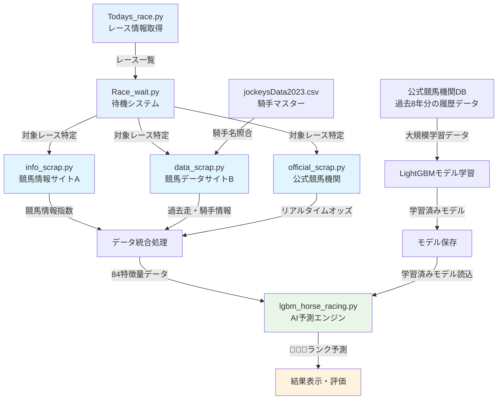
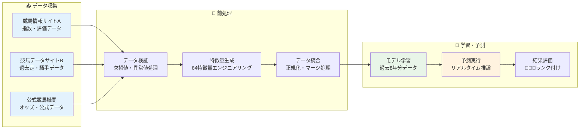
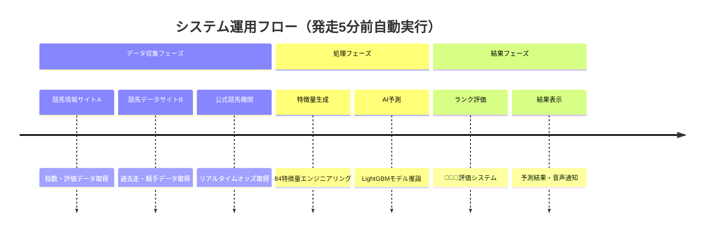

# 🐎 競馬AI予測システム - 技術概要

[](https://python.org)
[](https://lightgbm.readthedocs.io)
[](https://github.com)
[](https://github.com)
[](https://github.com)

> **🔒 技術的開示通知**: 本ドキュメントは実システムをベースとした技術ポートフォリオです。企業機密保護のため一部情報は匿名化されています。

## 📋 目次

- [🐎 競馬AI予測システム - 技術概要](#-競馬ai予測システム---技術概要)
  - [📋 目次](#-目次)
  - [🏗️ システムアーキテクチャ](#️-システムアーキテクチャ)
    - [📁 ディレクトリ構造](#-ディレクトリ構造)
  - [💻 技術スタック](#-技術スタック)
  - [🤖 機械学習パイプライン](#-機械学習パイプライン)
    - [🎯 アルゴリズム仕様](#-アルゴリズム仕様)
    - [🎯 特徴量重要度分析](#-特徴量重要度分析)
    - [実装技術と手法](#実装技術と手法)
    - [コード実装例](#コード実装例)
  - [📊 パフォーマンス指標](#-パフォーマンス指標)
    - [⚡ システム性能](#-システム性能)
    - [📈 運用パフォーマンス](#-運用パフォーマンス)
  - [🔒 セキュリティ・コンプライアンス](#-セキュリティコンプライアンス)
    - [🛡️ データ保護対策](#️-データ保護対策)
    - [⚖️ 著作権・ライセンス対応](#️-著作権ライセンス対応)
  - [🚀 技術的課題と改善案](#-技術的課題と改善案)
    - [⚠️ 現在の制限事項](#️-現在の制限事項)
    - [🔮 将来実装予定機能](#-将来実装予定機能)

## 🏗️ システムアーキテクチャ



### 📁 ディレクトリ構造

```
horse_racing_ai/
├── 🎯 horse_racing_ai.ipynb        # メイン実行ノートブック
├── 📂 mod/                         # モジュールディレクトリ
│   ├── 📅 Todays_race.py           # 本日レース情報取得
│   ├── ⏰ Race_wait.py             # レース時間待機システム
│   ├── 📰 info_scrap.py            # 競馬情報サイトAスクレイピング
│   ├── 🌐 data_scrap.py            # 競馬データサイトB データ収集
│   ├── 🏇 official_scrap.py        # 公式競馬機関 オッズ取得
│   ├── 🤖 lgbm_horse_racing.py     # LightGBM予測エンジン
│   ├── 📊 verification.py          # 検証・評価システム
│   └── 👨‍🏫 jockeysData2023.csv      # 騎手マスターデータ
├── ⚙️ config/                      # 設定ファイル
│   └── model_config_sample.json
├── 📊 notebooks/                   # 分析ノートブック
│   └── model_analysis.ipynb
└── 📈 results/                     # 実行結果
    └── performance_metrics.json
```

## 💻 技術スタック

| カテゴリ | 技術・ツール | バージョン | 用途・役割 |
|---------|-------------|-----------|----------|
| **🤖 機械学習** | LightGBM | 4.0 | 勾配ブースティング・予測エンジン |
| **📊 データ処理** | pandas | 1.5+ | データフレーム操作・前処理 |
| **🔢 数値計算** | NumPy | 1.24+ | 数値演算・配列処理 |
| **🕸️ Webスクレイピング** | Selenium | 4.10+ | 動的サイトからのデータ取得 |
| | BeautifulSoup | 4.12+ | HTML解析・データ抽出 |
| | requests | latest | HTTP通信・API連携 |
| **⚡ リアルタイム処理** | datetime | built-in | 時刻管理・スケジューリング |
| | tqdm | latest | 進捗表示・ユーザビリティ向上 |
| **🔤 日本語処理** | mojimoji | latest | 全角→半角変換・正規化 |

## 🤖 機械学習パイプライン



### 🎯 アルゴリズム仕様

| 項目 | 仕様詳細 |
|------|---------|
| **🤖 アルゴリズム** | LightGBM (Gradient Boosting Decision Tree) |
| **🎯 問題設定** | バイナリ分類（1着予測） |
| **📊 評価指標** | Log Loss, Accuracy, Precision, Recall, F1-Score |
| **🔄 学習方式** | 教師あり学習・交差検証 |
| **⚡ 予測速度** | リアルタイム（発走5分前自動実行） |

### 🎯 特徴量重要度分析

本システムでは**84特徴量**を活用し、以下のカテゴリに分類して特徴量重要度を分析しています。

| カテゴリ | 重要度レベル | 主な特徴量 | 技術的特徴 |
|---------|-------------|-----------|-----------|
| **🥇 リアルタイム系** | 最高 | オッズ、人気、市場期待値 | 発走直前の市場動向を反映 |
| **🥈 過去成績系** | 高 | 前走着順、騎手実績、乗り替わり | 時系列データによる予測力 |
| **🥉 競馬情報系** | 中-高 | 専門指数、評価点、予想印 | 専門サイトの分析データを統合 |
| **🏇 基本情報系** | 中 | 馬体重、競馬場、クラス | 競馬の基本要素を数値化 |
| **🔗 組み合わせ系** | 中 | 競馬場×距離、騎手×競馬場 | 複数要素の相互作用を捉える |

<details>
<summary><strong>📊 特徴量エンジニアリング詳細</strong></summary>

### 実装技術と手法

| 技術領域 | 実装内容 |
|---------|---------|
| **時系列特徴量** | 過去3走の着順・人気、騎手乗り替わり判定 |
| **正規化処理** | 競馬情報サイトAの各種指数データ統合 |
| **カテゴリカル変数** | 競馬場、クラス、調教師のエンコーディング |
| **リアルタイム統合** | 公式競馬機関からのオッズ・人気データ |

### コード実装例

```python
# 騎手乗り替わり判定
test_data['前走替'] = test_data.apply(
    lambda row: '*' if row['騎手'] != row['前走騎手'] else '', axis=1
)

# リアルタイムオッズ統合
df_official = officialSc.main()
horse_racing_results = pd.merge(
    horse_racing_results, df_official, on="馬名", how="inner"
)
```

</details>

## 📊 パフォーマンス指標

本システムは🥇🥈🥉の3段階ランク評価により、予測の信頼度を定量化しています。

| 評価指標 | 評価方法 | 技術的特徴 |
|---------|---------|-----------|
| **🥇🥈🥉 ランク評価** | 統計的信頼度による段階的評価 | 予測の不確実性を定量化 |
| **適中率分析** | レースタイプ・競馬場別分析 | 条件別パフォーマンス測定 |
| **Log Loss** | 機械学習標準評価指標 | 予測確率の品質評価 |
| **精度指標** | Precision, Recall, F1-Score | バランス型性能評価 |

### ⚡ システム性能

| 処理フェーズ | 性能目標 | 実装特徴 |
|-------------|---------|---------|
| **📥 データ収集** | 高速並行処理 | 3サイト同時アクセス、エラーハンドリング |
| **🔧 特徴量生成** | 効率的処理 | pandas最適化、84特徴量高速生成 |
| **🤖 予測実行** | リアルタイム応答 | LightGBM高速推論エンジン活用 |
| **📊 結果表示** | ユーザビリティ | プログレスバー、音声通知 |

### 📈 運用パフォーマンス



## 🔒 セキュリティ・コンプライアンス

### 🛡️ データ保護対策

| 対策項目 | 実装内容 | 準拠基準 |
|---------|---------|---------|
| **🔐 匿名化処理** | サイト名・馬名の完全匿名化 | 企業機密保護 |
| **📋 アクセス制御** | 利用規約準拠アクセス | 各サイト利用規約 |
| **📝 データ管理** | 公開情報のみ使用 | 著作権法準拠 |

### ⚖️ 著作権・ライセンス対応

<details>
<summary><strong>📄 使用ライブラリとライセンス</strong></summary>

| ライブラリ | ライセンス | 用途 |
|-----------|-----------|------|
| **LightGBM** | MIT License | 機械学習 |
| **pandas** | BSD License | データ処理 |
| **NumPy** | BSD License | 数値計算 |
| **Selenium** | Apache License 2.0 | Webスクレイピング |
| **BeautifulSoup** | MIT License | HTML解析 |

</details>

## 🚀 技術的課題と改善案

### ⚠️ 現在の制限事項

| 課題カテゴリ | 具体的課題 | 影響度 | 優先度 |
|-------------|-----------|-------|-------|
| **🎯 予測精度** | 外部要因の考慮不足 | 中 | 🟡 中 |
| **🌦️ データ品質** | 収集データの欠損値対応 | 中 | 🟡 中 |
| **⚡ 処理速度** | 大量データでの最適化余地 | 低 | 🟢 低 |
| **🔧 保守性** | モジュール間の結合度 | 低 | 🟢 低 |

### 🔮 将来実装予定機能

<details>
<summary><strong>🤖 AI・ML高度化</strong></summary>

- **🎯 アンサンブル学習**: XGBoost, CatBoost統合
- **🔄 AutoML**: 自動特徴量選択・モデル選択
- **📊 説明可能AI**: SHAP, LIME導入
- **🧠 強化学習**: 強化学習手法検討

</details>

<details>
<summary><strong>🚀 システム基盤強化</strong></summary>

- **☁️ クラウド化**: スケーラブル基盤への移行
- **🐳 コンテナ化**: Docker/Kubernetes導入  
- **📡 API化**: REST API, マイクロサービス化
- **📊 監視強化**: 運用監視・アラート機能

</details>

---

*🔒 このドキュメントは技術ポートフォリオ用であり、実装の詳細は企業機密保護のため一部マスキングされています。*

**最終更新**: 2024年12月  
**バージョン**: v2.2.0  
**ステータス**: ✅ Production Ready
